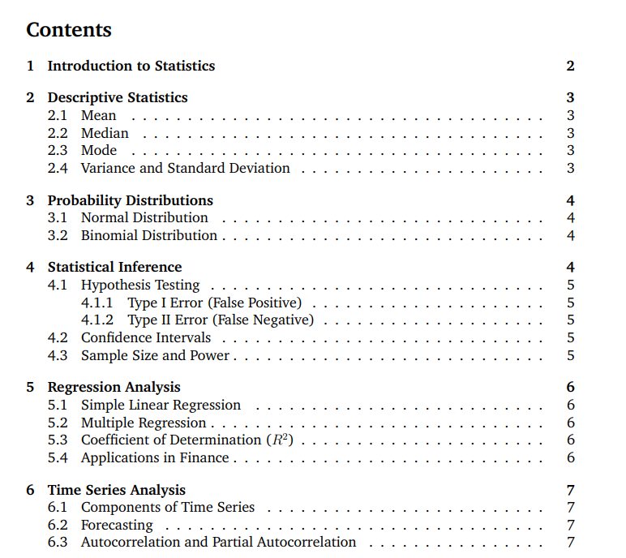

# Statistics for Quants

This repository contains a PDF that offers a concise and easy-to-understand overview of key statistical concepts tailored for quants. From basic descriptive statistics to advanced time series models, this document aims to demystify complex topics for both beginners and professionals in the field of quantitative finance.

## Access the PDF

You can access and download the full PDF [here](./statistics_for_quants.pdf).

## Preview

## Additional Information

This document was created to serve as a handy reference guide. Feedback and contributions are welcome!
